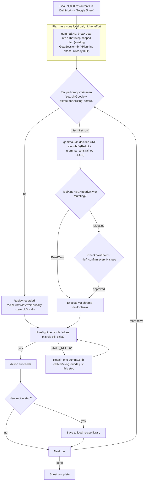

# MICE plan — Auto: a 4B-parameter autonomous browsing architecture (2026-07-23)

> Continues plan v7 (M13 tool registry, M14 axi engine — both already built) and
> plan v9's coordination-mesh line of work. Milestones here are numbered M17a–d.
> This document folds in a dedicated research pass (below) so the rationale for
> every design decision is traceable to a source, not asserted.

## 0. The ask, verbatim intent

The user's standing vision for MICE's autonomous side: a "side-by-side partner"
you can hand a complex, repetitive task to — the worked example used throughout
this document is *"make a Google Sheet named '1,000 Restaurants in Delhi', find
1,000 real restaurants, and list their name/phone/PIN code into the sheet"* —
and it goes and does it in the background, entirely on-device, no cloud calls,
no data leaving the laptop. The explicit hard constraint: **the local model is
gemma3:4b, possibly stretching to ~5B, and no bigger.** The ask was not "make
the model smarter" but "research deeply — including non-LLM history, RPA,
pre-LLM headless browsing, CS concepts — and find the architecture that makes
this constraint work anyway."

Three concrete symptoms were named as why the current build feels "nowhere
close" to that vision:

1. MICE halts and asks `[y/N]` for nearly every action — it cannot run
   unattended in the background.
2. gemma3:4b gets overwhelmed on cluttered real pages (Wikipedia, Canva) —
   hallucinated clicks on elements that don't exist, lost track of state.
3. CAPTCHAs / anti-bot systems block a backgrounded agent that a human would
   sail through.

## 1. Current state, verified against the working tree (not assumed)

All three symptoms trace to specific, findable code — useful, because it means
none of this requires guessing at "what's probably wrong."

**Symptom 1 — confirmation on every action.** `autopilot_axi()`
(`crates/mice-cli/src/main.rs`) prints `"Every browser action will be shown and
requires your confirmation."` up front, then for each proposed action prints
`"Proposed action N/6: …"` followed by `print!("Do this one action? [y/N] ");`
— unconditionally, for every action, capped at 6 actions per invocation. It
does **not** consult the `ToolKind::ReadOnly` / `ToolKind::Mutating` split that
already exists in `crates/mice-cli/src/tools.rs` — that distinction is real,
built, and simply not wired into this gate yet.

**Symptom 2 — hallucinated/lost state on cluttered pages.** Not an impression;
measured in this repo's own prior research
(`plan/mice_research_industry_landscape.md`): gemma3:4b scores **19.6** on the
Berkeley Function-Calling Leaderboard's agentic/multi-turn score, against
Claude Haiku's **68.7**. Recent commits on this branch (`86ca1f0` "clarify fill
action JSON instruction for small models", `127e269` "remove pedantic DOM
context checks to fix looping", `eb20707` "tolerate dynamic UID shifts after
user confirmation") are prompt-level patches on a structural mismatch: a 4B
model is being asked to freehand-decide a fresh action, from scratch, on every
single turn of every run — which is exactly the job class it scores worst on.
This is not a criticism of the model; it's a description of what job it's
currently being given.

**Symptom 3 — CAPTCHA / anti-bot.** Not addressed in code today. The two
primitives it needs — `AgentAction::Handoff` (`crates/mice-core/src/lib.rs`,
already a first-class action) and an "attach to my real, logged-in Chrome"
mode (`CHROME_DEVTOOLS_AXI_AUTO_CONNECT`, documented in
`plan/mice_planv7_slm_tool_manager.md`) — already exist for unrelated reasons.
This is mostly wiring, covered under Pillar D.

**What's already good and must not be rebuilt:**

- chrome-devtools-axi's `browser.snapshot` is already close to the
  accessibility-tree observation format the research below converges on
  (uid-based, not raw DOM) — a real head start over a from-scratch DOM agent.
- It already surfaces a clean, deterministic failure signal: uids carry a
  generation prefix (`g<N>:`), and acting on a re-rendered page fails loudly
  with `STALE_REF` rather than silently misclicking.
- A local→cloud escalation cascade already exists:
  `ExecutionLane::{Local, CheapCloud, Frontier}`
  (`crates/mice-core/src/lib.rs`), with `AXI_LOCAL_UNCERTAINTY_LIMIT: u8 = 2`
  (`crates/mice-cli/src/main.rs`) — gemma3:4b gets two uncertain turns before
  falling back, gated by explicit user consent when `PrivacyMode::CloudAllowed`
  (`confirm_axi_cloud_fallback`).
- `GoalSession`'s `Planning` phase already separates "figure out the plan" from
  "execute the plan" as distinct states — the planner/executor split in §3
  below is largely *formalizing what half-exists already*, not inventing new
  machinery.
- Plan v5 (`plan/mice_planv5_web_autopilot.md`) already specified almost
  exactly the confirmation UX Pillar A proposes — "consent once per goal…
  Esc stops instantly… per-action confirmation survives as an opt-in careful
  mode" — before the axi engine (M14) hardened it back into confirm-everything.
  Pillar A is largely *finishing a decision already made*, not a new UX bet.

## 2. Research pass (2026-07-23) — findings and citations

A dedicated research pass was run to answer the question as asked: not "how do
we make gemma3:4b smarter" but "what architectures — including non-LLM and
pre-LLM history — let a fixed small model do this job well." Full findings by
area, condensed from source material (all links verified reachable at time of
writing):

### 2.1 Grounding & observation-space reduction

Full raw HTML is a primary reason small models fail — WorkArena-class pages
run 40K–500K tokens, guaranteeing overflow/confusion for a 4B context budget.
The field converges on three simplifications, each stricter than the last:

- **Accessibility-tree-only observation** (tag + role + name, not full
  DOM/CSS) is the default in WebArena, Mind2Web, and BrowserArena — this alone
  strips most of the layout noise that confuses a small model.
- **Set-of-Mark (SoM)** prompting ([Yang et al., 2023](https://github.com/microsoft/SoM))
  overlays numbered boxes on interactive regions so a vision-capable model
  picks a mark number instead of a coordinate or DOM path. [SeeAct](https://osu-nlp-group.github.io/SeeAct/)
  ("GPT-4V is a Generalist Web Agent, if Grounded",
  [arXiv 2401.01614](https://arxiv.org/pdf/2401.01614)) found SoM alone
  underperforms grounding via element attributes/textual choice — marks help a
  model *express* an action, not *decide* which one is right. Relevant
  negative result: don't expect visual marking alone to fix decision quality.
- **Aggressive pruning on top of the AX tree** (2025-era, most directly
  applicable to a 4B budget): [Prune4Web](https://arxiv.org/html/2511.21398)
  (DOM Tree Pruning Programming — keep only interactive-tagged/ARIA-role
  elements), [FocusAgent](https://arxiv.org/html/2510.03204) (a lightweight
  retriever LLM re-ranks AX-tree lines by goal relevance before the main model
  sees them), [Beyond Pixels: DOM Downsampling](https://arxiv.org/html/2508.04412v1),
  [LineRetriever](https://arxiv.org/html/2507.00210v1) (goal-conditioned line
  filtering), [Region4Web](https://arxiv.org/html/2605.07134) (cluster
  elements into regions instead of a flat list).
- **Diff-based observation**: WebRISE marks only elements that changed since
  the previous step instead of re-serializing the whole page every turn — a
  large context win for multi-step tasks, and a direct extension of MICE's
  existing `g<N>:` generation-prefixed uids.
- [AutoWebGLM](https://dl.acm.org/doi/10.1145/3637528.3671620) (KDD 2024) and
  [CogAgent](https://arxiv.org/pdf/2312.08914) both beat larger general LLMs on
  Mind2Web *because* they train on a reduced/simplified observation, not raw
  pixels or raw HTML — evidence that observation engineering, not model scale,
  is the dominant lever.

### 2.2 Action-space & output-format constraints

- **Grammar-constrained decoding** (GBNF, native to
  [llama.cpp](https://github.com/ggml-org/llama.cpp/blob/master/grammars/README.md);
  JSON-Schema→FSM compilation as used by Outlines/guidance) forces the sampler
  to only emit tokens that keep the output on a valid path through a formal
  grammar. This is a hard constraint at the sampler level, not a prompt — a 4B
  model *cannot* emit a malformed action even if it "wants to." llama.cpp
  ships JSON-schema→GBNF conversion natively and is usable through Ollama.
- **Enumerated/closed action vocabulary** (act on one of N labeled elements,
  never a freehand selector) turns "generate a CSS selector" (hard,
  hallucination-prone) into "pick option 7" — closer to what small models are
  actually competent at.
- **ReAct** (explicit think-then-act) is near-universal in this literature:
  forcing a reasoning span before the action measurably reduces invalid
  actions versus direct action prediction.
- **Self-consistency / majority vote** (sample N times, take the majority)
  helps with *noise* ("did I misread which button is Search"), not *bias* — a
  systematically wrong small model stays wrong on majority vote. Useful, not a
  silver bullet.
- **Deterministic verifier over LLM-critic**: the strongest pattern found is
  external, checkable verification rather than a second model guess — the
  Prover-Agent pattern (LLM proposes, a compiler verifies, failure feeds back)
  hit 88% with a small model specifically because the verifier is
  deterministic. Directly portable: before executing a click, check whether
  the uid still exists in the current snapshot — free, zero-latency, and
  catches exactly the hallucinated-element and stale-uid failure classes
  already in this repo's commit history.

### 2.3 Planner/executor hierarchical splits

Formalized as **Plan-and-Solve Prompting** ([Wang et al., 2023](https://www.langchain.com/blog/planning-agents))
and productionized as LangChain's Plan-and-Execute pattern: one call produces
a stable, ordered multi-step plan; a separate executor is invoked once per
step with only that step plus the current observation — never the whole task.
This is the most-cited mitigation for small-model degradation on long-horizon
tasks, because per-step action selection is a far narrower task than
open-ended planning. [ReAcTree](https://arxiv.org/pdf/2511.02424) ("Beyond
ReAct: Planner-Centric Framework") refines this into a two-level hierarchy:
big/slow reasoning (plan) → small/fast reasoning (per-step ReAct) → tiny/
deterministic reasoning (single action + verifier). Explicitly recommended:
"a smaller LLM can serve as the executor while a larger LLM acts as the
planner" — for MICE this doesn't require a second model; the *same*
gemma3:4b run once at higher effort/lower temperature for planning, then many
times at low effort for execution, is architecturally cheap and maps directly
onto `GoalSession`'s existing `Planning` → execution split.

### 2.4 Memory / skill-library reuse

[Voyager](https://arxiv.org/abs/2305.16291) (Minecraft agents, 2023) is the
canonical reference: a vector-indexed skill library, keyed by task-description
embeddings, lets an agent retrieve a previously-verified action program for a
similar situation instead of re-deriving it from scratch, then adapt rather
than invent. [SkillFlow](https://arxiv.org/pdf/2504.06188) (2025) is a newer,
more directly applicable paper on scalable skill retrieval for this exact
purpose. Web-agent analogue: store successful DOM-interaction trajectories
("how to search on Google," "how to create a Sheet and append a row") keyed by
an embedding of (site + goal shape); on a new run, retrieve-and-adapt the
nearest match. This shrinks gemma3:4b's job from "invent this interaction
sequence cold" to "does this recipe still apply" — closer to a classification
task, which is closer to what a 4B model is actually good at.

### 2.5 Pre-LLM RPA / programming-by-demonstration lineage (the highest-leverage angle)

This predates LLMs entirely and is the single most load-bearing finding.
**CoScripter/Koala** ([IBM Research](https://en.wikipedia.org/wiki/CoScripter))
recorded human browser demonstrations into semi-natural-language,
human-readable, shareable scripts — zero ML, replay purely structural
(element-description matching). **Vegemite** ([ACM](https://dl.acm.org/doi/10.1145/1502650.1502667))
extended CoScripter into a spreadsheet-mashup tool: record a data-extraction
demonstration once, replay across many rows of input — structurally
*identical* to "find 1,000 restaurants, one row each." **Sikuli**
([MIT, ACM](https://dl.acm.org/doi/pdf/10.1145/1622176.1622213)) took the
opposite approach: pure visual template matching, technology-agnostic but
brittle to any pixel/resolution change. Modern commercial RPA (UiPath) has
converged on **layered selector fallback**: anchor-based selectors (identity
attributes) primary, computer-vision matching fallback, and — as of UiPath's
["Healing Agent"](https://www.uipath.com/blog/product-and-updates/technical-tuesday-how-healing-agent-solves-ui-automation-challenges) —
an LLM invoked **only when the selector fails**, to regenerate it or reason
about the UI change, never to drive routine steps.

**The architectural pitch this validates directly:** record a working
interaction path once (from the first successful LLM-driven run), replay it
deterministically via uid/AX-tree matching with zero LLM involvement for as
long as it keeps working, and invoke gemma3:4b only at the moment a uid fails
to resolve — i.e. use the small model exclusively as a repair/regrounding
step, not a per-action driver. This removes the model from the vast majority
of steps where it currently has no reason to be involved at all, which is a
more direct fix for the logged "UID shift" and "looping" failure classes than
any further prompt engineering.

### 2.6 CAPTCHA / anti-bot — reduction, not evasion

Ethical mitigations in the literature converge on reducing how bot-like a
session *looks*, not defeating a challenge: persistent cookies/session state
across runs (a "returning user" signal, not a fresh session every time),
randomized (not fixed) inter-action delays, and — most importantly for a real
desktop agent — driving an actual installed browser profile rather than a
fresh headless instance, since headless-specific fingerprints (missing
plugins, automation-flagged navigator properties, canvas/WebGL anomalies) are
the primary server-side signal, more than timing. The only fully reliable
answer to an actual CAPTCHA challenge remains a clean human handoff at exactly
that moment — a special case of §2.7, not a separate mechanism. (Scope note:
this research deliberately did not investigate CAPTCHA-solving/bypass
services — reduction and handoff only.)

### 2.7 Confidence-gated autonomy (the direct fix for "confirm every click")

The dominant published pattern is **tiered action classification by
risk/reversibility**, not per-action confidence scoring: read-only/navigation
actions run autonomously and log; destructive/irreversible/payment-adjacent
actions always gate. The [AURA risk framework](https://arxiv.org/pdf/2510.15739)
measured **66.9% fewer incidents** with adaptive tiering versus unrestricted
autonomy in simulation. Critically, this is preferred over confidence-
threshold gating because **self-reported LLM confidence is unreliable** —
models learn to report high confidence below their actual competence
threshold (["Behavioral Credibility Trilemma", 2026](https://arxiv.org/html/2605.25739)) —
gating on a model's opinion of itself is a documented failure mode, not a fix.
The complementary UX pattern is **checkpoint batching**: execute a batch of
same-tier steps, then summarize-and-confirm once, rather than confirming every
individual action — see [Human-in-the-Loop Escalation Design](https://www.digitalapplied.com/blog/human-in-the-loop-escalation-design-ai-agents-2026).

### 2.8 Small local models for GUI/computer-use specifically

[AutoWebGLM](https://dl.acm.org/doi/10.1145/3637528.3671620) (KDD 2024,
purpose-built web-navigation LLM + AutoWebBench) and [CogAgent](https://arxiv.org/pdf/2312.08914)
(visual GUI VLM, heavier than 4B) both beat larger general LLMs on real-site
navigation via training + observation design, not scale. [Ferret-UI Lite](https://arxiv.org/abs/2509.26539)
("Lessons from Building Small On-Device GUI Agents") is the most directly
relevant: an explicitly small, on-device GUI agent scoring 91.6% ScreenSpot-V2
/ 61.2% OSWorld-G against far larger models — worth reading as a design
reference even without adopting the model. There is evidence that ~1B-scale
fine-tunes with Chain-of-Action-Thought already match larger general LLMs on
GUI navigation (Android in the Zoo) — a signal that 4B is *not* the
fundamental ceiling assumed; training/format is. No published gemma3:4b-
specific agent fine-tune or WebArena/Mind2Web leaderboard entry was found —
the practical path today is stock gemma3:4b via Ollama with a hand-built
grammar-constrained action schema (§2.2), not waiting for a purpose-tuned
checkpoint.

### 2.9 If you had to pick three

In priority order, reasoned from the above:

1. **Record-once, replay-deterministically, repair-with-LLM-only-on-failure**
   (§2.5). Removes gemma3:4b from the vast majority of steps entirely — fixes
   more of the "small model gets overwhelmed" problem than any prompting
   technique, because the model is no longer in the loop for the steps it's
   bad at.
2. **Grammar-constrained JSON decoding + a deterministic pre-execution
   verifier** (§2.2). Makes hallucinated/invalid actions structurally
   impossible rather than "less likely," and catches stale-uid/nonexistent-
   element actions before they reach the browser — the most direct fix for
   the "UID shift"/"looping" bug classes already in the commit history.
3. **Tiered, batched confirmation instead of per-click confirmation** (§2.7).
   Resolves the "[y/N] every click" complaint without requiring any model-
   capability improvement at all.

## 3. The core reframe: Record → Replay → Repair



The model is in the loop for the plan, the first row, and any repair. For rows
2 through 1,000 it is, by design, mostly out of the loop — which is the direct
targeted fix for the reported failure mode: a 4B model doesn't get a chance to
hallucinate or lose track of state on a page it isn't being asked to freshly
reason about.

## 4. Four supporting pillars

### Pillar A — tiered, batched confirmation

Fixes "[y/N] on every click" directly. Wire `ToolKind` into the axi confirm
gate:

- `ToolKind::ReadOnly` actions (scroll, snapshot, navigate-to-known-url) run
  and log without a prompt.
- `ToolKind::Mutating` actions (click, fill, submit) batch into a checkpoint:
  "About to do these N things — proceed?" instead of one prompt per action.
- Gate on the tool's declared reversibility, **not** the model's self-reported
  confidence (§2.7) — `say_to_user`/`question` text is for narration, never a
  gating signal.
- Hard stops stay absolute regardless of tier: MICE never fills credentials or
  payment data, never clicks sign-in/payment/transfer/final-submission
  controls, per the existing policy already enforced elsewhere in the
  codebase — this plan does not touch that boundary.

Sketch (illustrative, not final code):

```rust
// crates/mice-cli/src/main.rs, inside the axi action loop
let tier = tool_registry.kind_for(&call.name); // existing ToolKind lookup
match tier {
    ToolKind::ReadOnly => { /* execute immediately, log */ }
    ToolKind::Mutating => {
        pending_checkpoint.push(call.clone());
        if pending_checkpoint.len() >= config.autopilot.checkpoint_batch_size
            || decision.action == AgentAction::Done
        {
            confirm_checkpoint(&pending_checkpoint)?; // one prompt, N actions
            for queued in pending_checkpoint.drain(..) { execute(queued)?; }
        }
    }
}
```

### Pillar B — make hallucinated actions structurally impossible

Two changes:

1. **Grammar-constrained decoding.** Replace the prompt-text JSON instruction
   (the fragile fix in `86ca1f0`) with a real GBNF grammar generated from the
   `ToolDecision` / `AgentDecision` schema, passed to Ollama so the sampler
   cannot emit a malformed action. Needs a local check of the installed
   Ollama version's grammar/constrained-output support before this is scoped
   as "just wire it up" (see open questions).
2. **Deterministic pre-flight verification.** Before firing an action, check
   whether the target uid still exists in the current snapshot — the same
   check `STALE_REF` already does, just proactive instead of reactive. Free,
   zero-latency, and catches the exact class of bug `eb20707` patched
   reactively.

### Pillar C — a local recipe library that compounds

On-disk, embedding-keyed store of successful step sequences (Voyager/
SkillFlow pattern, §2.4). Sketch:

```
~/Library/Application Support/MICE/recipes/
  <embedding-bucket>/<recipe-id>.json
```

```jsonc
{
  "recipe_id": "google-search-and-open-result",
  "site_pattern": "google.com/search",
  "goal_embedding": [ /* local embedding of the goal shape */ ],
  "steps": [
    { "tool": "browser.open", "args": { "url": "https://google.com" } },
    { "tool": "browser.fill", "args": { "target": "search box" } },
    { "tool": "browser.press", "args": { "key": "Enter" } }
  ],
  "success_count": 47,
  "last_repaired": "2026-07-20T10:00:00Z"
}
```

Record on every success; before asking gemma3:4b to plan a step cold, retrieve
the nearest matching recipe by embedding similarity and adapt it. This is the
feature that makes MICE measurably faster/more reliable the more it's used,
with zero fine-tuning and zero data leaving the machine. Needs a small local
embedding model alongside gemma3:4b (tens-of-millions-of-parameters range —
see open questions for sizing).

### Pillar D — CAPTCHA posture: reduce, then hand off

No evasion. Default autopilot to the existing
`CHROME_DEVTOOLS_AXI_AUTO_CONNECT` attach-to-real-Chrome mode (a logged-in,
cookie-bearing, non-headless profile is the single biggest anti-bot-trigger
reducer per §2.6). Detect CAPTCHA-shaped pages (known iframe/element
signatures) specifically to trigger `AgentAction::Handoff` rather than
burning retries against them.

## 5. Worked example: 1,000 restaurants in Delhi

| Stage | What happens | Local LLM calls | Confirmations shown |
|---|---|---|---|
| Plan | gemma3:4b breaks the goal into: open Sheets → create sheet → search Google per restaurant → extract name/phone/PIN → append row → repeat | 1 | 1 (review the plan) |
| Teach (row 1) | Model drives row 1 for real — search, open result, extract fields, append. Every successful step is saved as a recipe. | ~6–10 | 1 checkpoint ("do this pattern 999 more times?") |
| Replay (rows 2–1,000) | Deterministic recipe replay through chrome-devtools-axi. Pre-flight uid check every step; no freehand model decision unless something breaks. | 0, unless a break | 0 — batched into periodic progress checkpoints |
| Repair (as needed) | A listing looks different, or Google changes layout mid-run → one bounded gemma3:4b call re-grounds just that row. | ~1 per break (estimate: low tens, not 1,000) | 0, unless the repair itself is ambiguous |

Call counts are illustrative estimates, not a benchmark result — the real
number depends on how often the site's layout actually varies row to row.

## 6. Current vs. proposed

| | Today (`autopilot_axi`, M14) | Proposed (this plan, on top of M14) |
|---|---|---|
| Confirmation | `[y/N]` before every action, capped at 6/run | Auto-run read-only, checkpoint-confirm mutating batches |
| Model's job per step | Freehand-decide every step, every time | Decide once, replay many, repair rarely |
| Invalid actions | Reduced by prompt wording (probabilistic) | Structurally blocked by grammar + pre-flight check |
| Repeat tasks | No memory — re-reasons from scratch every run | Recipe library — gets faster/more reliable with use |
| CAPTCHA | Not handled | Reduced via real-profile attach; clean handoff on hit |
| Privacy / cost | 100% local, $0 | Unchanged — 100% local, $0 |

## 7. Milestones

### M17a — Wire ToolKind into the axi confirm gate + checkpoint batching

Smallest change, most direct relief for the standing complaint — the two
pieces (`ToolKind`, the axi confirm loop) already exist and are simply not
connected.

- Add `checkpoint_batch_size` to `AutopilotConfig` (default small, e.g. 3–5).
- `autopilot_axi()` consults `ToolKind` per proposed action: `ReadOnly` runs
  immediately; `Mutating` queues into a batch, confirmed once per batch (or on
  `Done`/`Handoff`/`AskUser`), not once per action.
- Hard-stop blocklist (credentials, payment, sign-in, final-submit) is
  unaffected — always gates regardless of tier.

**Acceptance:** a goal that mixes scrolls/navigation with 3 clicks shows one
checkpoint prompt for the clicks, not four `[y/N]` prompts. Unit tests: tier
classification → batch-vs-immediate routing (mocked runner, no network).

### M17b — Grammar-constrained decisions + pre-flight verify

- Generate a GBNF grammar from `ToolDecision`'s schema; pass to Ollama's
  constrained-output path (needs local verification of current Ollama version
  support — see §8).
- Add a pre-flight check in the axi action loop: resolve the target uid
  against the latest snapshot before dispatching the action; treat a miss the
  same as a reactive `STALE_REF` (one retry with a fresh snapshot, then
  escalate).

**Acceptance:** a decision with a malformed/unknown tool name cannot reach
execution (grammar rejects it at generation time — test via a canned model
response fixture). A stale uid is caught pre-flight in a test with a mocked
runner returning a snapshot that no longer contains the target uid.

### M17c — Recipe / skill library

- On-disk store per §4 Pillar C sketch; local embedding model chosen and
  sized (open question, §8).
- Record: every successful `Mutating` action sequence between two `Done`/
  checkpoint boundaries is offered for saving as a recipe (or auto-saved,
  pending the open question below).
- Retrieve: before the model plans a step cold, look up the nearest recipe by
  embedding similarity against (site + goal shape); on a hit, replay via
  Pillar A/B's execute-and-verify path instead of a fresh decision call.

**Acceptance:** running the same goal shape twice against the same site
results in materially fewer local LLM calls on the second run (measured, not
asserted — log calls-per-task like the existing research doc's methodology).
A recipe that fails pre-flight verification triggers repair, not silent
misexecution.

### M17d — CAPTCHA-aware handoff

- Default `mice autopilot --engine axi` to `CHROME_DEVTOOLS_AXI_AUTO_CONNECT`
  attach mode when a compatible Chrome is available (config flag already
  exists per plan v7; this changes the default and documents it in
  `mice doctor`).
- Add CAPTCHA-page detection (known iframe/element signatures) to the
  observe step; on a hit, route straight to `AgentAction::Handoff` instead of
  retrying the current step.

**Acceptance:** a scripted page containing a CAPTCHA-shaped iframe triggers
handoff within one observation cycle, not after exhausting retries.

## 8. Risks and open questions

- **Recipes go stale when a site redesigns.** Expected, not a flaw — this is
  exactly what the `STALE_REF`-triggered repair path is for. Open: does a
  repaired step overwrite the old recipe automatically, or queue for a quick
  human glance first? Leaning toward auto-overwrite with the prior version
  kept for one generation, pending a decision.
- **This does not raise gemma3:4b's ceiling on novel sites.** Honest framing:
  the win is architectural — fewer chances for the model to be wrong — not a
  higher reasoning ceiling. First-time-on-a-new-site tasks still hit the
  model's real limits, which is why the plan pass, teach-on-row-1, and the
  existing `ExecutionLane` escalation to `CheapCloud`/`Frontier` all remain in
  place as the safety valve.
- **Recipe retrieval needs a local embedding model.** Still small and
  feasible (tens-of-millions-of-parameters range run fine alongside
  gemma3:4b), but it's a new local dependency that needs sizing/selection
  before M17c starts, not assumed for free.
- **Ollama grammar/constrained-output support needs local verification.**
  GBNF is native to llama.cpp; Ollama's own API surface for constrained JSON
  output should be re-checked against the currently installed Ollama version
  before M17b is scoped as "just wire it up."
- **Auto-save vs. review-before-save for new recipes (M17c).** Not yet
  decided — flagged here rather than defaulted, since it affects how much
  trust the recipe library earns early on.

## 9. Sequencing

M17a (confirm-gate wiring) → M17b (grammar + pre-flight verify) → M17c
(recipe library) → M17d (CAPTCHA posture). Ordered by relief-per-line-of-code:
M17a is the smallest change with the most immediate effect on the standing
complaint and has no dependency on the others; M17b hardens the execution
path that M17c's replay loop will lean on; M17d is independent and can move
in parallel if a second implementer is available.

## Source index

- [WebArena](https://arxiv.org/pdf/2307.13854)
- [Prune4Web](https://arxiv.org/html/2511.21398)
- [FocusAgent](https://arxiv.org/html/2510.03204)
- [Region4Web](https://arxiv.org/html/2605.07134)
- [Beyond Pixels: DOM Downsampling](https://arxiv.org/html/2508.04412v1)
- [LineRetriever](https://arxiv.org/html/2507.00210v1)
- [Set-of-Mark (microsoft/SoM)](https://github.com/microsoft/SoM)
- [SeeAct](https://osu-nlp-group.github.io/SeeAct/)
- [GPT-4V is a Generalist Web Agent, if Grounded](https://arxiv.org/pdf/2401.01614)
- [llama.cpp grammars](https://github.com/ggml-org/llama.cpp/blob/master/grammars/README.md)
- [Voyager](https://arxiv.org/abs/2305.16291)
- [SkillFlow](https://arxiv.org/pdf/2504.06188)
- [CoScripter (Wikipedia)](https://en.wikipedia.org/wiki/CoScripter)
- [Vegemite (ACM)](https://dl.acm.org/doi/10.1145/1502650.1502667)
- [Sikuli (ACM)](https://dl.acm.org/doi/pdf/10.1145/1622176.1622213)
- [UiPath Healing Agent](https://www.uipath.com/blog/product-and-updates/technical-tuesday-how-healing-agent-solves-ui-automation-challenges)
- [AutoWebGLM](https://dl.acm.org/doi/10.1145/3637528.3671620)
- [CogAgent](https://arxiv.org/pdf/2312.08914)
- [Ferret-UI Lite](https://arxiv.org/abs/2509.26539)
- [Plan-and-Execute Agents (LangChain)](https://www.langchain.com/blog/planning-agents)
- [ReAcTree](https://arxiv.org/pdf/2511.02424)
- [AURA Risk Framework](https://arxiv.org/pdf/2510.15739)
- [Behavioral Credibility Trilemma](https://arxiv.org/html/2605.25739)
- [Human-in-the-Loop Escalation Design](https://www.digitalapplied.com/blog/human-in-the-loop-escalation-design-ai-agents-2026)
- [Human-like browsing patterns](https://scrapingant.com/blog/human-like-browsing-patterns)
- Internal: `plan/mice_research_industry_landscape.md` (BFCL benchmark table),
  `plan/mice_planv5_web_autopilot.md` (original consent/careful-mode design),
  `plan/mice_planv7_slm_tool_manager.md` (chrome-devtools-axi facts, M13–M16)
